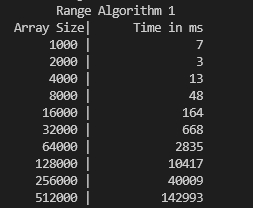
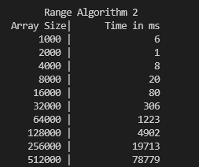
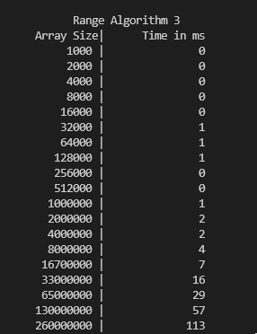

Runtime Measurement of 3 different Range Algorithms
---------------------------------------------------

The range algorithm is to compute the maximum difference of any 2 given elements in an array

Range 1 Algorithm - Brute Force Solution. Iterate through each element and then compute difference of that element
with ALL of the elements in the Array. Runtime is O(n^2) because you iterate through the whole N-sized Array for N amount of times.  

Here is the runtime in miliseconds for each N sized Array 

Range 2 Algorithm - Similar to Range 1 Algorithm, but only iterate from the CURRENT element of the array and the end. This is because you don't have to 
go through the same pair of elements again once you've gone through them already. Runtime is still O(n^2).

Here is the runtime in miliseconds for each N sized Array 

Range 3 Algorithm - Instead of comparing each pair of element. You only need to find the maximum and minimum number of the array then compute the difference
between the two. Runtime is O(n) because you only go though the array once.

Here is the runtime in miliseconds for each N sized Array 

Here is a runtime comparison of each algorithm side by side

--------------------------------------------------------------
source code is located in src folder.
